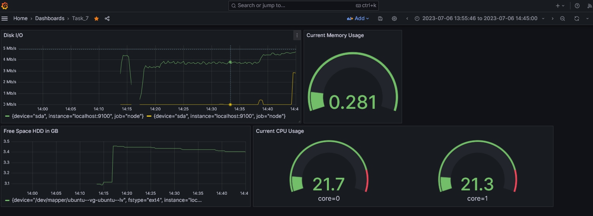
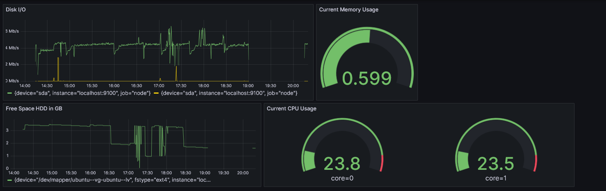

- Prometheus

 

prometheus version

 

 

запуск ptometheus

 

- Grafana

-- для установки - vpn https://whoer.net/ru/vpn/trial

-- установка https://grafana.com/docs/grafana/latest/setup-grafana/installation/debian/

 

graphana service

 

 

graphana web

 

- Grafana Conf

 

graphana connect prometheus

 

- - disk I/O 

rate(node_disk_reads_completed_total{device="sda", instance="localhost:9100"}[1m])

rate(node_disk_writes_completed_total{device="sda", instance="localhost:9100"}[1m])

- - current mem usage

(node_memory_MemTotal_bytes{instance="localhost:9100"} - node_memory_MemFree_bytes{instance="localhost:9100"}) / node_memory_MemTotal_bytes{instance="localhost:9100"}

- - cpu

100 - (avg by (cpu)(irate(node_cpu_seconds_total{instance="localhost:9100",mode="idle"}[30m]))) * 100

- - hdd

node_filesystem_avail_bytes{instance="localhost:9100", mountpoint="/"} / 1024 / 1024 / 1000

 

graphana dash

 

- При запуске скрипта засорения файловой системы

 

graphana dash

 

- При запуске утилиты stress

 

graphana dash

 

