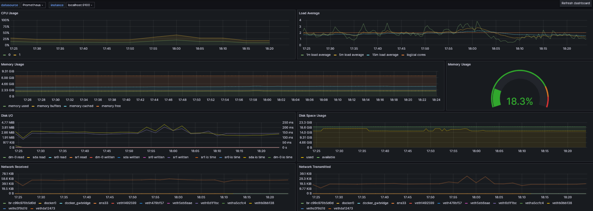
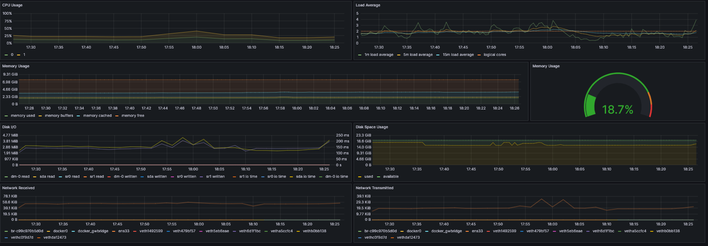
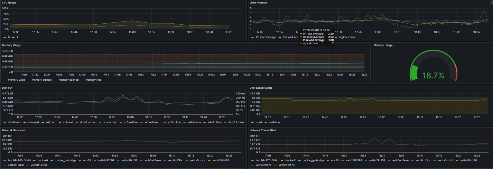
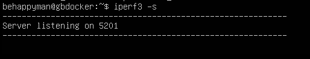
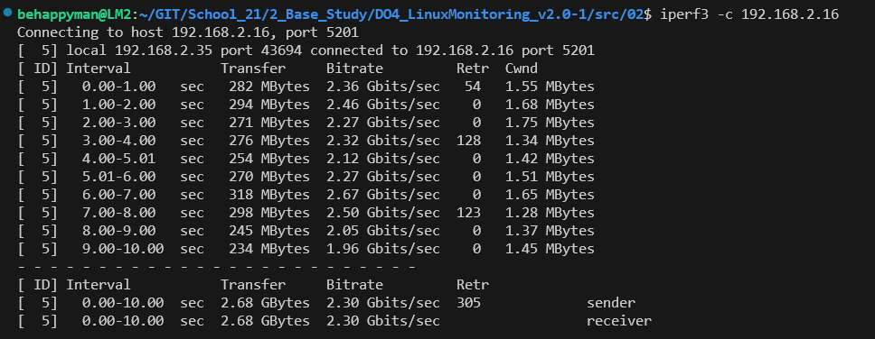
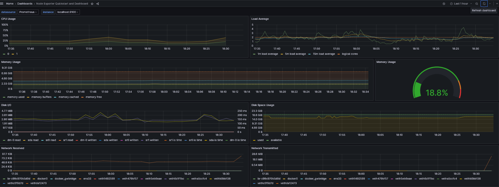

 

graphana dash

 

- При запуске скрипта засорения файловой системы

 

graphana dash

 

- При запуске утилиты stress

 

graphana dash

 

- При запуске iperf

 

iperf server

 

 

iperf client

 

 

graphana dash

 

