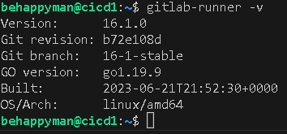
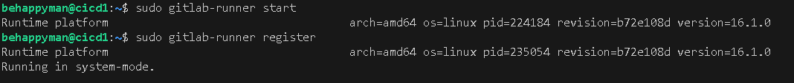

## Part 1. Настройка gitlab-runner

- Поднять виртуальную машину Ubuntu Server 20.04 LTS

- Скачать и установить на виртуальную машину gitlab-runner

###### https://docs.gitlab.com/runner/install/linux-manually.html

 

 

- Запустить gitlab-runner и зарегистрировать его для использования в текущем проекте (DO6_CICD)

- Для регистрации понадобятся URL и токен, которые можно получить на страничке задания на платформе.

 

 

## Part 2. Сборка

Написать этап для CI по сборке приложений из проекта C2_SimpleBashUtils:
В файле gitlab-ci.yml добавить этап запуска сборки через мейк файл из проекта C2
Файлы, полученные после сборки (артефакты), сохранять в произвольную директорию со сроком хранения 30 дней.

