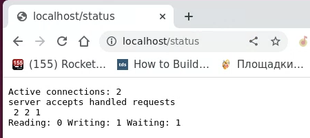

## Part 1. Готовый докер

- Взять официальный докер образ с nginx и выкачать его при помощи docker pull. 
- Проверить наличие докер образа через docker images. 

 

получение образа и проверка его наличия

 

- Запустить докер образ через docker run -d [image_id|repository]
- Проверить, что образ запустился через docker ps

 

получение образа и проверка его наличия

 

- Посмотреть информацию о контейнере через docker inspect [container_id|container_name]
- По выводу команды определить и поместить в отчёт размер контейнера, список замапленных портов и ip контейнера

 

 

 

 

 

 

 

 

информация о портах, размере, ip

- Остановить докер образ через docker stop [container_id|container_name]
- Проверить, что образ остановился через docker ps

 

 

информация о портах, размере, ip

- Запустить докер с портами 80 и 443 в контейнере, замапленными на такие же порты на локальной машине, через команду run

 

 

проброс портов

- Проверить, что в браузере по адресу localhost:80 доступна стартовая страница nginx

 

 

стартовая страницы nginx на localhost

- Перезапустить докер контейнер через docker restart [container_id|container_name]
- Проверить любым способом, что контейнер запустился

 

 

перезапуск контейнера

## Part 2. Операции с контейнером
Докер образ и контейнер готовы. Теперь можно покопаться в конфигурации nginx и отобразить статус страницы.

- Прочитать конфигурационный файл nginx.conf внутри докер контейнера через команду exec

 

 

nginx.conf внутри контейнера

- Создать на локальной машине файл nginx.conf
- Настроить в нем по пути /status отдачу страницы статуса сервера nginx

 

 

создание nginx.conf и настройка страницы статуса

- Скопировать созданный файл nginx.conf внутрь докер образа через команду docker cp
- Перезапустить nginx внутри докер образа через команду exec

 

 

копирование конфигурационного файла, перезапуск nginx

Проверить, что по адресу localhost:80/status отдается страничка со статусом сервера nginx

 

 

копирование конфигурационного файла, перезапуск nginx

- Экспортировать контейнер в файл container.tar через команду export
- Остановить контейнер

 

 

экспорт контейнера, остановка

- Удалить образ через docker rmi [image_id|repository], не удаляя перед этим контейнеры
- Удалить остановленный контейнер

 

 

удаление образа, контейнера

- Импортировать контейнер обратно через команду import
- Запустить импортированный контейнер

 

 

импорт, запуск

usefull: https://qna.habr.com/q/240643

- Проверить, что по адресу localhost:80/status отдается страничка со статусом сервера nginx

 

 

страница статуса после перезапуска

## Part 3. Мини веб-сервер
Настало время немного оторваться от докера, чтобы подготовиться к последнему этапу. Настало время написать свой сервер.
== Задание ==

- Написать мини сервер на C и FastCgi, который будет возвращать простейшую страничку с надписью Hello World!

 

 

код сервера

- Запустить написанный мини сервер через spawn-fcgi на порту 8080

 

 

запуск сервера на порту 8080

- Написать свой nginx.conf, который будет проксировать все запросы с 81 порта на 127.0.0.1:8080

 

 

nginx.conf

- Проверить, что в браузере по localhost:81 отдается написанная вами страничка

sudo nginx -s reload

 

 

hello world

- Положить файл nginx.conf по пути ./nginx/nginx.conf (это понадобится позже)

## Part 4. Свой докер
Теперь всё готово. Можно приступать к написанию докер образа для созданного сервера. При написании докер образа избегайте множественных вызовов команд RUN

- Написать свой докер образ, который:

1) собирает исходники мини сервера на FastCgi из Части 3

2) запускает его на 8080 порту

3) копирует внутрь образа написанный ./nginx/nginx.conf

4) запускает nginx.
nginx можно установить внутрь докера самостоятельно, а можно воспользоваться готовым образом с nginx'ом, как базовым.

Собрать написанный докер образ через docker build при этом указав имя и тег

Проверить через docker images, что все собралось корректно

Запустить собранный докер образ с маппингом 81 порта на 80 на локальной машине и маппингом папки ./nginx внутрь контейнера по адресу, где лежат конфигурационные файлы nginx'а (см. Часть 2)

docker run -it --name container -p 80:81 -v /Users/killedhi/DO5_SimpleDocker-1/src/04/nginx.conf:/etc/nginx/nginx.conf -d killedhi:a1 bash.

Проверить, что по localhost:80 доступна страничка написанного мини сервера

Дописать в ./nginx/nginx.conf проксирование странички /status, по которой надо отдавать статус сервера nginx

Перезапустить докер образ
Если всё сделано верно, то, после сохранения файла и перезапуска контейнера, конфигурационный файл внутри докер образа должен обновиться самостоятельно без лишних действий

Проверить, что теперь по localhost:80/status отдается страничка со статусом nginx

## Part 5. Dockle

После написания образа никогда не будет лишним проверить его на безопасность.
== Задание ==

Просканировать образ из предыдущего задания через dockle [image_id|repository]

Исправить образ так, чтобы при проверке через dockle не было ошибок и предупреждений

## Part 6. Базовый Docker Compose

Вот вы и закончили вашу разминку. А хотя погодите...
Почему бы не поэкспериментировать с развёртыванием проекта, состоящего сразу из нескольких докер образов?
== Задание ==

Написать файл docker-compose.yml, с помощью которого:

1) Поднять докер контейнер из Части 5 (он должен работать в локальной сети, т.е. не нужно использовать инструкцию EXPOSE и мапить порты на локальную машину)

2) Поднять докер контейнер с nginx, который будет проксировать все запросы с 8080 порта на 81 порт первого контейнера

Замапить 8080 порт второго контейнера на 80 порт локальной машины

Остановить все запущенные контейнеры

Собрать и запустить проект с помощью команд docker-compose build и docker-compose up

Проверить, что в браузере по localhost:80 отдается написанная вами страничка, как и ранее