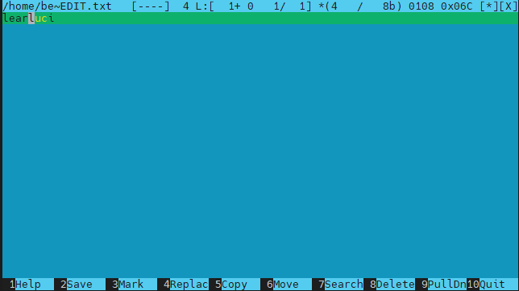
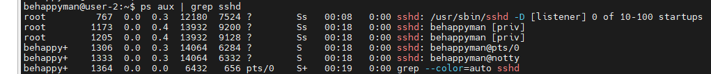
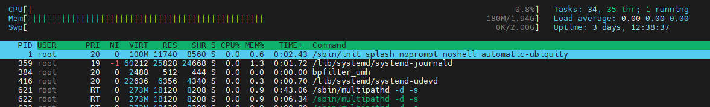
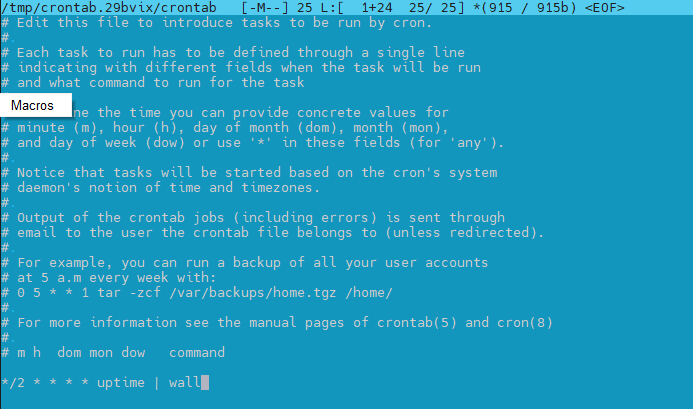

## Part 1. Установка ОС
- Скриншот версии Ubuntu  
  
Скриншот версии Ubuntu
## Part 2. Создание пользователя
- создание пользователя  
  
- вывод cat /etc/passwd
  

## Part 3. Настройка сети ОС

- Задать название машины вида user-1  
sudo hostnamectl set-hostname user-1  
- Установить временную зону, соответствующую вашему текущему местоположению  
dpkg-reconfigure tzdata  
  
- Вывести названия сетевых интерфейсов с помощью консольной команды.  
  
- Дать объяснение интерфейсу lo  
lo - петля - адрес 127.0.0.1 - для доступа к хосту с него же  
- Используя консольную команду получить ip адрес устройства, на котором вы работаете, от DHCP сервера.  
sudo dhclient enp0s3  
  
DHCP («Dynamic Host Configuration Protocol» протокол динамической настройки узла)   
- Определить и вывести на экран внешний ip-адрес шлюза (ip) и внутренний IP-адрес шлюза, он же ip-адрес по умолчанию (gw).  
- - внешний  
behappyman@user-1:~$ curl ifconfig.me/ip  
46.8.219.63
- - gw 
behappyman@user-1:~$ route -n  
Kernel IP routing table  
Destination     Gateway         Genmask         Flags Metric Ref    Use Iface   
0.0.0.0         192.168.2.1     0.0.0.0         UG    0      0        0 enp0s3  

- Задать статичные (заданные вручную, а не полученные от DHCP сервера) настройки ip, gw, dns (использовать публичный DNS серверы, например 1.1.1.1 или 8.8.8.8).  
behappyman@user-1:~$ sudo nano /etc/netplan/00-installer-config.yaml  
  

behappyman@user-1:~$ sudo netplan apply

behappyman@user-1:~$ sudo netplan try  

Do you want to keep these settings?  
Press ENTER before the timeout to accept the new configuration  
Changes will revert in 118 seconds  
Configuration accepted.  

- Перезагрузить виртуальную машину. Убедиться, что статичные сетевые настройки (ip, gw, dns) соответствуют заданным в предыдущем пункте.

behappyman@user-1:~$ sudo reboot

behappyman@user-1:~$ Connection to 192.168.2.22 closed by remote host.

Connection to 192.168.2.22 closed.

- Успешно пропинговать удаленные хосты 1.1.1.1 и ya.ru и вставить в отчёт скрин с выводом команды. В выводе команды должна быть фраза "0% packet loss".

## Part 4. Обновление ОС

behappyman@user-1:~$ sudo apt update  

behappyman@user-1:~$ sudo apt dist-upgrade  

## Part 5. Использование команды sudo

- Разрешить пользователю, созданному в Part 2, выполнять команду sudo.  

behappyman@user-1:~$ sudo visudo  
user2 ALL=(ALL) ALL  

- sudo — это программа командной строки, которая позволяет доверенным пользователям выполнять команды от имени пользователя root или другого пользователя.

- Поменять hostname ОС от имени пользователя, созданного в пункте Part 2 (используя sudo).

behappyman@user-1:~$ su user2

user2@user-1:/home/behappyman$ sudo hostnamectl set-hostname user-2  

  

## Part 6. Установка и настройка службы времени

behappyman@user-2:~$ sudo apt install ntp  

sudo systemctl start ntp

- Вывести время, часового пояса, в котором вы сейчас находитесь.
- Вывод следующей команды должен содержать NTPSynchronized=yes: 
timedatectl show

- Вставить скрины с корректным временем и выводом команды в отчёт.

## Part 7. Установка и использование текстовых редакторов\

- vim

behappyman@user-2:~$ vim test_VIM.txt

ESC -> :wq для сохранения

behappyman@user-2:~$ vim test_VIM.txt

ESC -> :q! для выхода без сохранения

поиск:

замена: 

- nano

behappyman@user-2:~$ nano test_NANO.txt

Cntrl - O -> Enter -> Cntrl - X для сохранения

Cntrl - X без сохранения

поиск:  

замена: 

Cntrl - \ -> luc -> Enter -> TUC -> Y

- mcedit

sudo apt-get install mcedit

F10 -> YES -> Enter для сохранения

F10 -> NO -> Enter для сохранения

поиск:

замена:

F4 для замены

## Part 8. Установка и базовая настройка сервиса SSHD

- Установить службу SSHd.

behappyman@user-2:~$ sudo apt-get install ssh

- Добавить автостарт службы при загрузке системы.

behappyman@user-2:~$ sudo systemctl enable ssh.service

- Перенастроить службу SSHd на порт 2022.

behappyman@user-2:~$ sudo mcedit /etc/ssh/sshd_config

behappyman@user-2:~$ sudo ufw allow 2022

behappyman@user-2:~$ sudo reboot

- Используя команду ps, показать наличие процесса sshd. Для этого к команде нужно подобрать ключи.

behappyman@user-2:~$ ps aux | grep sshd

ps aux - показать все процессы  
ps aux | grep sshd - отфильтровать по sshd  

- перезагрузить систему

behappyman@user-2:~$ sudo reboot

- Вывод команды netstat -tan должен содержать  
tcp 0 0 0.0.0.0:2022 0.0.0.0:* LISTEN  
(если команды netstat нет, то ее нужно установить)

netstat - информация о подключении к сетевому сокету системы
t - связанное с протоколом TCP  
a - все статусы  
n - отображать IP и порт в цифрах, запрещать обратный запрос DNS;  

столбцы:

Proto - протокол соединения  
Recv-Q - буфер полученных пакетов  
Send-Q - буфер отправленных пакетов  
Local Address - локальный адрес и порт  
Foreign Address - внешний адрес и порт  
State - состояние  
0.0.0.0 - Если говорить о серверах, то 0.0.0.0 означает все адреса IPv4 на локальной машине. В случае записи маршрута это означает маршрут по умолчанию.  

## Part 9. Установка и использование утилит top, htop

- По выводу команды top определить и написать в отчёте:
  - uptime

    uptime 3 days 12:23

  - количество авторизованных пользователей

    2 users

  - общую загрузку системы

    load average: 0.00, 0.00, 0.00

  - общее количество процессов

    Tasks: 103 total, 1 running, 102 sleeping, 0 stopped, 0 zombie

  - загрузку cpu

    0.0 us, 0.3 sy, 0.0 ni, 99.7 id, 0.0 wa, 0.0 hi, 0.0 si, 0.0 st

    us - Time spent in user space  
    sy - Time spent in kernel space  
    ni - Time spent running niced user processes (User defined priority)  
    id - Time spent in idle operations  
    wa - Time spent on waiting on IO peripherals (eg. disk)  
    hi - Time spent handling hardware interrupt routines. (Whenever a peripheral unit want attention form the CPU, it literally pulls a line, to signal the CPU to service it)  
    si - Time spent handling software interrupt routines. (a piece of code, calls an interrupt routine...)  
    st - Time spent on involuntary waits by virtual cpu while hypervisor is servicing another processor (stolen from a virtual machine)  

  - загрузку памяти

    MiB Mem : - загрузка оперативной памяти, MiB Swap: - загрузка файла подкачки

  - pid процесса занимающего больше всего памяти

    Shift - M - сортировка процессов по задействованной памяти

    

    Max memory usage PID: 726

  - pid процесса, занимающего больше всего процессорного времени

    базовая сортировка. PID процесса - 10

- В отчёт вставить скрин с выводом команды htop:
  - отсортированному по PID, PERCENT_CPU, PERCENT_MEM, TIME

    

    сортировка по pid

    

    htop %CPU sort

    

    htop %mem sort

    

    htop time sort

  - отфильтрованному для процесса sshd

    

    htop sshd filter

  - с процессом syslog, найденным, используя поиск 

    

    htop find syslog

  - с добавленным выводом hostname, clock и uptime  

    
    
    htop with hostname clock and uptime

## Part 10. Использование утилиты fdisk

- Запустить команду fdisk -l.

    

    sudo fdisk - l

- В отчёте написать название жесткого диска, его размер и количество секторов, а также размер swap.

    - название: /dev/sda
    - размер: 25 GiB
    - количество секторов: 52428800
    - swap: 2G

    

    swap show

## Part 11. Использование утилиты df

##### Запустить команду df.  

df

- В отчёте написать для корневого раздела (/):
  - размер раздела - 11758760 в блоках по 1Кбайт
  - размер занятого пространства - 4831752
  - размер свободного пространства - 6307900
  - процент использования - 44
- Определить и написать в отчёт единицу измерения в выводе:  1 Кбайт

##### Запустить команду df -Th.

df -Th

- В отчёте написать для корневого раздела (/):
    - размер раздела - 12 Gb
    - размер занятого пространства - 4.7 Gb
    - размер свободного пространства - 6.1 Gb
    - процент использования - 44
- Определить и написать в отчёт тип файловой системы для раздела - ext4

## Part 12. Использование утилиты du

- Запустить команду du.

- Вывести размер папок /home, /var, /var/log (в байтах, в человекочитаемом виде)

    du home var var/log ver 1

    du home var var/log ver 2

- Вывести размер всего содержимого в /var/log (не общее, а каждого вложенного элемента, используя *)

du /var/log/*

- В отчёт вставить скрины с выводом всех использованных команд.

## Part 13. Установка и использование утилиты ncdu

- Установить утилиту ncdu.

behappyman@user-2:~$ sudo apt install ncdu

- Вывести размер папок /home, /var, /var/log.

ncdu /

- В отчёт вставить скрины с выводом использованных команд.

    home

    var

    /var/log/

## Part 14. Работа с системными журналами

- Открыть для просмотра:
- 1. /var/log/dmesg
- 2. /var/log/syslog
- 3. /var/log/auth.log  

tail logs

- Написать в отчёте время последней успешной авторизации, имя пользователя и метод входа в систему.

Mar 12 13:55:21 user-2 sshd

- Перезапустить службу SSHd.

sudo service sshd restart

- Вставить в отчёт скрин с сообщением о рестарте службы (искать в логах).

sshd restart into syslog

## Part 15. Использование планировщика заданий CRON

- Используя планировщик заданий, запустите команду uptime через каждые 2 минуты.

    crontab -e

    cron uptime process

- Найти в системных журналах строчки (минимум две в заданном временном диапазоне) о выполнении.

    cron in log

- Вывести на экран список текущих заданий для CRON.

    cron tasks

- Удалите все задания из планировщика заданий.

    remove tasks
