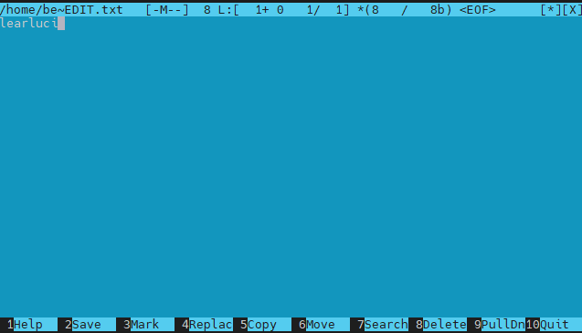

## Part 1. Установка ОС
- Скриншот версии Ubuntu  
  
Скриншот версии Ubuntu
## Part 2. Создание пользователя
- создание пользователя  
  
- вывод cat /etc/passwd
  

## Part 3. Настройка сети ОС

- Задать название машины вида user-1  
sudo hostnamectl set-hostname user-1  
- Установить временную зону, соответствующую вашему текущему местоположению  
dpkg-reconfigure tzdata  
  
- Вывести названия сетевых интерфейсов с помощью консольной команды.  
  
- Дать объяснение интерфейсу lo  
lo - петля - адрес 127.0.0.1 - для доступа к хосту с него же  
- Используя консольную команду получить ip адрес устройства, на котором вы работаете, от DHCP сервера.  
sudo dhclient enp0s3  
  
DHCP («Dynamic Host Configuration Protocol» протокол динамической настройки узла)   
- Определить и вывести на экран внешний ip-адрес шлюза (ip) и внутренний IP-адрес шлюза, он же ip-адрес по умолчанию (gw).  
- - внешний  
behappyman@user-1:~$ curl ifconfig.me/ip  
46.8.219.63
- - gw 
behappyman@user-1:~$ route -n  
Kernel IP routing table  
Destination     Gateway         Genmask         Flags Metric Ref    Use Iface   
0.0.0.0         192.168.2.1     0.0.0.0         UG    0      0        0 enp0s3  

- Задать статичные (заданные вручную, а не полученные от DHCP сервера) настройки ip, gw, dns (использовать публичный DNS серверы, например 1.1.1.1 или 8.8.8.8).  
behappyman@user-1:~$ sudo nano /etc/netplan/00-installer-config.yaml  
  

behappyman@user-1:~$ sudo netplan apply

behappyman@user-1:~$ sudo netplan try  

Do you want to keep these settings?  
Press ENTER before the timeout to accept the new configuration  
Changes will revert in 118 seconds  
Configuration accepted.  

- Перезагрузить виртуальную машину. Убедиться, что статичные сетевые настройки (ip, gw, dns) соответствуют заданным в предыдущем пункте.

behappyman@user-1:~$ sudo reboot

behappyman@user-1:~$ Connection to 192.168.2.22 closed by remote host.

Connection to 192.168.2.22 closed.

- Успешно пропинговать удаленные хосты 1.1.1.1 и ya.ru и вставить в отчёт скрин с выводом команды. В выводе команды должна быть фраза "0% packet loss".

## Part 4. Обновление ОС

behappyman@user-1:~$ sudo apt update  

behappyman@user-1:~$ sudo apt dist-upgrade  

## Part 5. Использование команды sudo

- Разрешить пользователю, созданному в Part 2, выполнять команду sudo.  

behappyman@user-1:~$ sudo visudo  
user2 ALL=(ALL) ALL  

- sudo — это программа командной строки, которая позволяет доверенным пользователям выполнять команды от имени пользователя root или другого пользователя.

- Поменять hostname ОС от имени пользователя, созданного в пункте Part 2 (используя sudo).

behappyman@user-1:~$ su user2

user2@user-1:/home/behappyman$ sudo hostnamectl set-hostname user-2  

  

## Part 6. Установка и настройка службы времени

behappyman@user-2:~$ sudo apt install ntp  

sudo systemctl start ntp

- Вывести время, часового пояса, в котором вы сейчас находитесь.
- Вывод следующей команды должен содержать NTPSynchronized=yes: 
timedatectl show

- Вставить скрины с корректным временем и выводом команды в отчёт.

## Part 7. Установка и использование текстовых редакторов\

- vim

behappyman@user-2:~$ vim test_VIM.txt

ESC -> :wq для сохранения

behappyman@user-2:~$ vim test_VIM.txt

ESC -> :q! для выхода без сохранения

поиск:

замена: 

- nano

behappyman@user-2:~$ nano test_NANO.txt

Cntrl - O -> Enter -> Cntrl - X для сохранения

Cntrl - X без сохранения

поиск:  

замена: 

Cntrl - \ -> luc -> Enter -> TUC -> Y

- mcedit

sudo apt-get install mcedit

F10 -> YES -> Enter для сохранения

F10 -> NO -> Enter для сохранения

поиск:

замена:

F4 для замены

## Part 8. Установка и базовая настройка сервиса SSHD

- Установить службу SSHd.

behappyman@user-2:~$ sudo apt-get install ssh

- Добавить автостарт службы при загрузке системы.

behappyman@user-2:~$ sudo systemctl enable ssh.service

- Перенастроить службу SSHd на порт 2022.

behappyman@user-2:~$ sudo mcedit /etc/ssh/sshd_config
behappyman@user-2:~$ sudo ufw allow 2022
behappyman@user-2:~$ sudo reboot

- Используя команду ps, показать наличие процесса sshd. Для этого к команде нужно подобрать ключи.

behappyman@user-2:~$ ps aux | grep sshd

ps aux - показать все процессы  
ps aux | grep sshd - отфильтровать по sshd  

- перезагрузить систему

behappyman@user-2:~$ sudo reboot

- Вывод команды netstat -tan должен содержать  
tcp 0 0 0.0.0.0:2022 0.0.0.0:* LISTEN  
(если команды netstat нет, то ее нужно установить)

netstat - информация о подключении к сетевому сокету системы
t - связанное с протоколом TCP  
a - все статусы  
n - отображать IP и порт в цифрах, запрещать обратный запрос DNS;  

столбцы:

Proto - протокол соединения  
Recv-Q - буфер полученных пакетов  
Send-Q - буфер отправленных пакетов  
Local Address - локальный адрес и порт  
Foreign Address - внешний адрес и порт  
State - состояние  
0.0.0.0 - Если говорить о серверах, то 0.0.0.0 означает все адреса IPv4 на локальной машине. В случае записи маршрута это означает маршрут по умолчанию.  

## Part 9. Установка и использование утилит top, htop
## Part 10. Использование утилиты fdisk
## Part 11. Использование утилиты df
## Part 12. Использование утилиты du
## Part 13. Установка и использование утилиты ncdu
## Part 14. Работа с системными журналами
## Part 15. Использование планировщика заданий CRON

